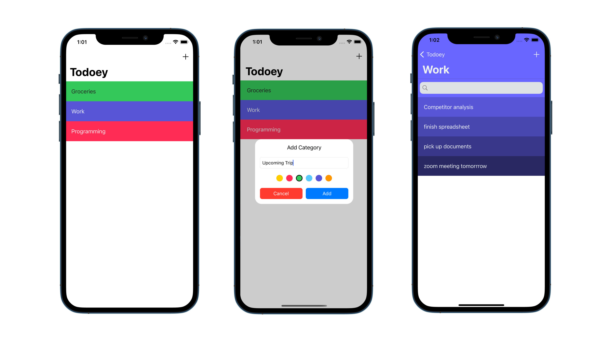

# Todoey ✓

## Goal

The objective of this app was to understand how to save data in iOS. I looked at various choices and learned to use UserDefaults, Core Data and Realm.

## What I created 

A todolist app to keep track of all your tasks.

